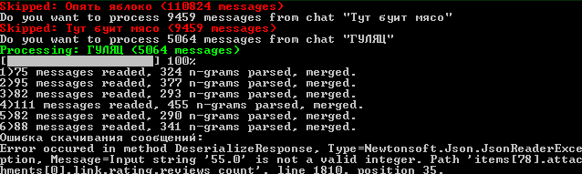
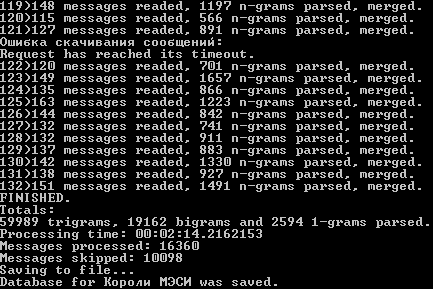

# VK Messages Dump
Данный проект представляет из себя утилиту для создания базы данных генератора текста на основе марковский цепей с помощью выгрузки сообщений из бесед в социальной сети VK.

## Использование
Для использования нужно изменить строку

> var tokenText = "PUT ACCESS TOKEN HERE";

в коде программы, указав в качестве значения Access Token,

который может быть получен при переходе по ссылке [(ТЫК)](https://oauth.vk.com/authorize?client_id=4025857&display=page&redirect_uri=https://oauth.vk.com/blank.html&scope=messages,offline&response_type=token&v=5.52)

## Скриншоты использования

## Лицензия

[MIT License](../LICENSE)
